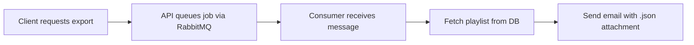

# 🎵 OpenMusic API v3 - Advanced Backend Submission

A powerful and scalable **music streaming API** built using **Node.js**, **Hapi.js**, and **PostgreSQL** — as part of the **AWS Back-End Academy** program by Dicoding.  
This third version brings **modern backend practices**: file uploads, caching, message queueing, and collaboration features.

> ✅ Built with real-world architecture principles  
> 🔁 Decoupled services via RabbitMQ  
> 📨 Playlist export via email

---

## 🚀 Key Features

### 🔧 Core Capabilities
- 🎶 **Songs & Albums**: Full CRUD, searchable songs, album management
- 🔐 **Authentication**: Secure login with JWT + refresh tokens
- 🎵 **Playlists**: Personal playlists with song management
- 👥 **Collaborations**: Share playlists with other users
- 📈 **Activity Logging**: Track changes in playlist contents

### 🧠 Advanced Implementations
- 📤 **File Uploads**: Album covers (local or AWS S3)
- ⚡ **Redis Caching**: Efficient album like counts
- 🐇 **Message Queue**: RabbitMQ for background processing
- 📧 **Email Exports**: Send playlist exports via email
- ❤️ **Album Likes**: Like/unlike albums with cache support

---

## 🗂 Project Structure

```
submission/
├── openmusic_api/        # Main API Server (Hapi.js)
│   ├── src/
│   ├── migrations/
│   └── package.json
└── openmusic_consumer/   # Worker Service for Playlist Export
    ├── src/
    └── package.json
```

---

## ✅ Implemented Milestones

- [x] **Playlist Export via RabbitMQ**
- [x] **Album Cover Upload**
- [x] **Album Like/Unlike Feature**
- [x] **Server-Side Redis Cache**
- [x] **Backward Compatibility with v1 & v2**

---

## 🛠 Tech Stack

| Category         | Technology                  |
|------------------|-----------------------------|
| Framework        | Hapi.js v21                 |
| Database         | PostgreSQL, node-pg-migrate |
| Auth             | JWT, bcrypt                 |
| Caching          | Redis                       |
| Queueing         | RabbitMQ, amqplib           |
| Email            | Nodemailer                  |
| Validation       | Joi                          |
| Storage          | Local / AWS S3              |

---

## 📡 API Overview

### 🔗 Albums
- `POST /albums` - Create album  
- `GET /albums/{id}` - Album + songs  
- `PUT /albums/{id}` - Update album  
- `DELETE /albums/{id}` - Delete album  
- `POST /albums/{id}/covers` - Upload cover  
- `POST /albums/{id}/likes` - Like (auth)  
- `DELETE /albums/{id}/likes` - Unlike (auth)  
- `GET /albums/{id}/likes` - Like count  

### 🎵 Songs
- `POST /songs`, `GET /songs`, `GET /songs/{id}`  
- `PUT /songs/{id}`, `DELETE /songs/{id}`  

### 👤 Users & Auth
- `POST /users` - Register  
- `POST /authentications` - Login  
- `PUT /authentications` - Refresh token  
- `DELETE /authentications` - Logout  

### 🎼 Playlists
- `POST /playlists` - Create  
- `GET /playlists`, `DELETE /playlists/{id}`  
- `POST /playlists/{id}/songs` - Add song  
- `GET /playlists/{id}/songs`, `DELETE /playlists/{id}/songs`  
- `GET /playlists/{id}/activities` - Activity log  

### 👥 Collaborations
- `POST /collaborations` - Add user  
- `DELETE /collaborations` - Remove user  

### 📤 Exports & Uploads
- `POST /export/playlists/{playlistId}`  
- `GET /uploads/{file*}` - Serve uploaded files  

---

## ⚙️ Setup & Installation

### 1️⃣ API Server
```bash
cd openmusic_api
npm install
npm run migrate:up
npm start
```

### 2️⃣ Consumer Service
```bash
cd openmusic_consumer
npm install
npm start
```

### 3️⃣ Required Services
- ✅ PostgreSQL  
- ✅ Redis  
- ✅ RabbitMQ  

---

## 🧬 Database Overview

| Table                     | Description                          |
|---------------------------|--------------------------------------|
| `albums`, `songs`         | Core music entities                  |
| `users`, `authentications`| User management + JWT refresh store |
| `playlists`, `playlist_songs` | Playlist structure              |
| `collaborations`          | Playlist sharing                     |
| `playlist_song_activities`| Song addition/removal logs           |
| `user_album_likes`        | Album likes                          |

---

## 🔐 Environment Variables

```env
# Server
HOST=localhost
PORT=5000

# PostgreSQL
PGUSER=your_db_user
PGPASSWORD=your_db_password
PGDATABASE=openmusic
PGHOST=localhost
PGPORT=5432

# JWT Auth
ACCESS_TOKEN_KEY=your_access_token_secret
REFRESH_TOKEN_KEY=your_refresh_token_secret
ACCESS_TOKEN_AGE=1800

# Redis & RabbitMQ
REDIS_SERVER=localhost:6379
RABBITMQ_SERVER=amqp://localhost

# Email (Nodemailer)
SMTP_HOST=smtp.gmail.com
SMTP_PORT=587
SMTP_USER=your_email@gmail.com
SMTP_PASSWORD=your_app_password

# AWS S3 (Optional)
AWS_BUCKET_NAME=your_bucket
AWS_ACCESS_KEY_ID=your_key
AWS_SECRET_ACCESS_KEY=your_secret
AWS_REGION=ap-southeast-1
```

---

## 🖼 File Uploads

- ✅ Local or AWS S3 storage  
- 🖼 Image types: JPG, PNG, GIF, WEBP, AVIF  
- 🚫 Max size: 512KB  
- 📂 Local directory: `src/uploads/`

---

## ⚡ Redis Caching

- Used for album like counts  
- TTL: 30 minutes  
- Key format: `album_likes:{albumId}`

---

## 📨 Playlist Export Flow



---

## 🔒 Security Measures

- Secure JWT tokens  
- Refresh token mechanism  
- Password hashing with bcrypt  
- Input validation via Joi  
- CORS and file type filtering

---

## ⚠️ Error Handling

| Code | Description               |
|------|---------------------------|
| 400  | Bad Request (validation) |
| 401  | Unauthorized              |
| 403  | Forbidden                 |
| 404  | Not Found                 |
| 413  | Payload Too Large         |
| 500  | Internal Server Error     |

---

## 🧪 Development Notes

### Run Migrations
```bash
npm run migrate create migration_name
npm run migrate:up
npm run migrate:down
```

### API Testing (Manual)
1. Register → `POST /users`  
2. Login → `POST /authentications`  
3. Use `Bearer <access_token>` in headers

---

## 📚 License

Part of the **Backend Expert Learning Path** from **Dicoding Indonesia**  
Built as a submission for the **AWS Back-End Academy** program.
